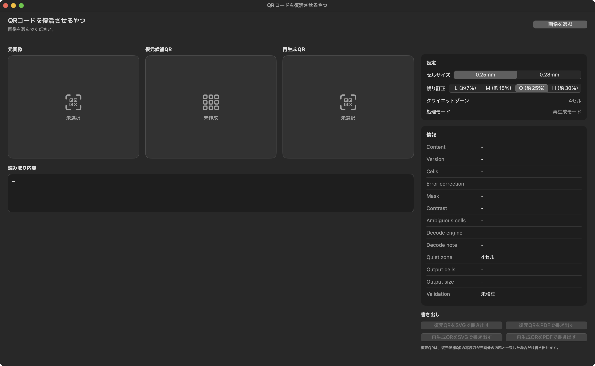

# QR Code Reviver for DTP

A macOS app that reads QR code images and rebuilds them as safer PDF/SVG files for DTP workflows.

[日本語 README](README.md)

## Overview

“QR Code Reviver for DTP” is a macOS app for cleaning up and rebuilding QR code images that are difficult to use in production, such as distorted, blurred, or low-resolution QR codes.

It is mainly intended for placement and verification in InDesign and Illustrator workflows.

## Main Features

- Reads QR code images
- Creates regenerated QR codes
- Creates restoration candidate QR codes
- Visualizes ambiguous cells
- Allows manual correction of restoration candidate QR codes
- Undo / ⌘Z support
- Flip-style comparison with the rectified source QR image
- Exports restored QR codes and regenerated QR codes as PDF
- Exports restored QR codes and regenerated QR codes as SVG
- Includes a 4-cell quiet zone
- Supports cell sizes of 0.25 mm and 0.28 mm

## Export Formats

### PDF

The recommended format for placing QR codes in InDesign.  
QR codes are exported as vector data.

### SVG

A supplementary format for checking and editing QR codes in Illustrator.

## How to Use

1. Drag and drop a QR code image into the app.
2. Check the decoded content.
3. Review the restoration candidate QR code and the regenerated QR code.
4. Edit the restoration candidate QR code if necessary.
5. Export the restored QR code or regenerated QR code as PDF/SVG.

## Notes

- No guarantee is provided for the results.
- The accuracy or completeness of this app’s reading results and output results is not guaranteed.
- Always verify exported QR codes using an actual device or QR code reader.
- Restored QR codes are created based on the cell layout derived from the source image, but they may not be restored correctly depending on the quality of the source image.
- If the restoration candidate QR code does not match the content decoded from the source image, it cannot be exported as a restored QR code.
- For print submission workflows, using the PDF format is recommended.

## Requirements

- macOS
- SwiftUI
- Xcode

## License

MIT License
